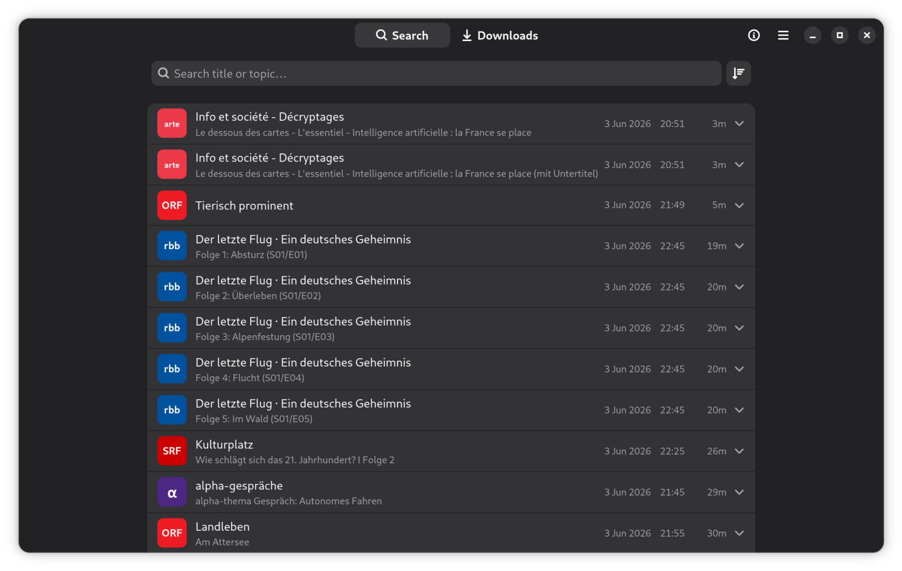
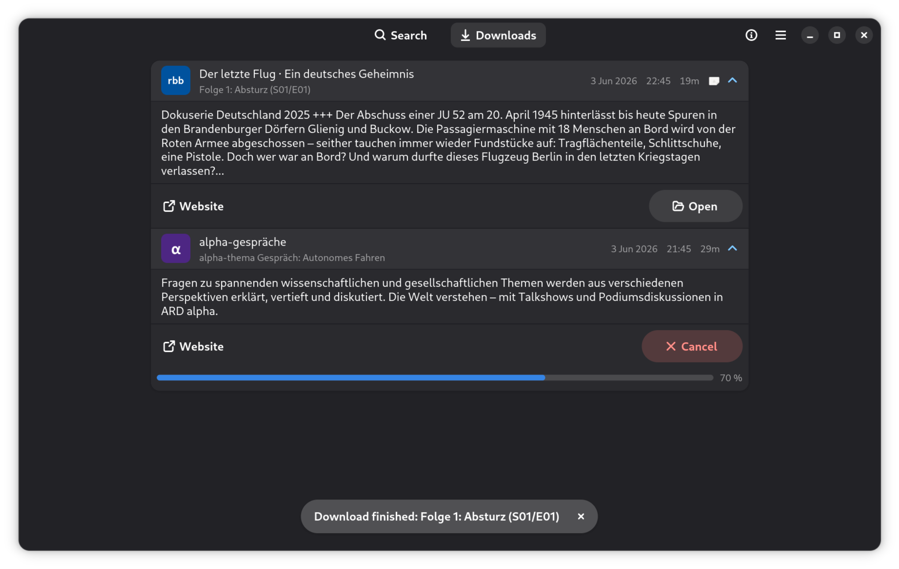

# Glotze

A GNOME-native desktop client for searching and downloading videos from
public broadcaster Mediatheken (DACH region), eg. ARD, ZDF, 3sat, arte,…


*Main view: search results*


*Downloads view*

Built with GTK 4 + libadwaita 1.7+ in Rust. Streaming and playback are out of
scope — Glotze hands you the file and steps out of the way.

The data source is the public [MediathekViewWeb](https://mediathekviewweb.de/)
JSON API, which already aggregates DACH public broadcaster, so Glotze
does not need to scrape per-channel sites.

## Install

Glotze offers two installation paths: **Flatpak** and
**Nix / flake**

### via Flatpak repository

Glotze is published as a self-hosted, GPG-signed Flatpak repository at
<https://tombreit.github.io/Glotze/>. Installing from there means
`flatpak update` keeps you current, just like a Flathub app:

```bash
# Only once: add the remote repo
flatpak install https://tombreit.github.io/Glotze/Glotze.flatpakref

# Later:
flatpak update io.github.tombreit.Glotze
flatpak run io.github.tombreit.Glotze
```

### via Download

Each [GitHub release](https://github.com/tombreit/Glotze/releases) also attaches a
`glotze.flatpak` bundle. The `/releases/latest/download/` URL is stable, so you
can fetch the most recent build without visiting the page:

```sh
# Download, install, run.
curl -LO https://github.com/tombreit/Glotze/releases/latest/download/glotze.flatpak
flatpak install --user ./glotze.flatpak
flatpak run io.github.tombreit.Glotze
```

### via Nix as a flake (NixOS)

No file to download — each release is its git tag, and the flake ref (with the
committed `flake.lock`) resolves it reproducibly. Pin a tag for a specific
release, or omit it to track `main` (newest tag on the
[releases page](https://github.com/tombreit/Glotze/releases)):

```sh
# A specific, reproducible release (replace with the newest tag):
nix run github:tombreit/Glotze/v0.0.18

# …or the latest commit on main:
nix run github:tombreit/Glotze

# Build a ./result symlink, or install into your profile:
nix build           github:tombreit/Glotze/v0.0.18
nix profile install github:tombreit/Glotze/v0.0.18
```

### Permissions

Verify the - minimal - set of requested permissions:

```sh
flatpak permission-show io.github.tombreit.Glotze
```

### Languages

To force a specific UI language (currently supported: `EN` and `DE`),
pass `LANGUAGE` into the sandbox — e.g. `--env=LANGUAGE=C` for English
(the source strings) or `--env=LANGUAGE=de` for German:
`flatpak run --env=LANGUAGE=de io.github.tombreit.Glotze`.

## Usage

Type a query (e.g. `Tagesschau`) into the search bar. Click a result row →
choose a quality → switch to **Downloads** to see the progress bar.

Files land in your XDG `Videos` directory (`~/Videos/Glotze`) (created if not exist).

Notes:

- Some channels or shows may be geo-restricted.
- Glotze doesn't have any settings (yet). If you'd rather set the download
location yourself, please [file an issue](https://github.com/tombreit/Glotze/issues).

## Uninstall

Uninstall Glotze completly:

```sh
flatpak uninstall --delete-data io.github.tombreit.Glotze
```

Glotze currently only saves a semaphore if you would like the welcome screen to
be displayed on every app start or not:
`~/.var/app/io.github.tombreit.Glotze/data/io.github.tombreit.Glotze/welcome-shown`

Your downloaded files are not affected by uninstalling Glotze.

## Development

### Runtime

The flatpak runtime is currently specified in three locations:

1. `build-aux/io.github.tombreit.Glotze.yml`
1. `.github/workflows/flatpak.yml`
1. `.github/workflows/pages.yml`

Note to my future self for bumping the runtime: Don't forget to set the
same runtime in all files.

### Build

```sh
sudo apt install build-essential pkg-config libgtk-4-dev libadwaita-1-dev libssl-dev
cargo run
```

Minimum versions verified against: GTK 4.14, libadwaita 1.7, Rust 1.92.

### Build flatpak

TODO/Currently triggered via `.github/workflows/flatpak.yml`

### Publishing/Distribution

Distribution via my own flatpak repository, hosted on Github Pages, is done via
a Github Action:

#### Setup GPG

```bash
# Generate signing key without passphrase
gpg --quick-generate-key "Glotze Flatpak Repo <mail@thms.de>" rsa4096 sign never

# Get fingerprint
gpg --fingerprint mail@thms.de

# Commit the public key
gpg --export <FINGERPRINT> > distribution/glotze.gpg

# base64 public key for GPGKey= of glotze.flatpakrepo and Glotze.flatpakref
gpg --export <FINGERPRINT> | base64 --wrap=0

# Store as GitHub Actions repository secrets
FLATPAK_GPG_PRIVATE_KEY → gpg --export-secret-keys --armor <FINGERPRINT> | base64 --wrap=0
FLATPAK_GPG_KEY_ID      → <FINGERPRINT>
```

#### Publish

`.github/workflows/pages.yml` runs on every `v*` tag (and on manual dispatch):

1. Imports the private signing key from the `FLATPAK_GPG_PRIVATE_KEY` secret.
1. Runs `flatpak-builder --repo=repo --gpg-sign=…` against
   `build-aux/io.github.tombreit.Glotze.yml`
1. Runs `flatpak build-update-repo`,
   producing a signed OSTree repo on the `stable` branch.
1. Copies this directory's files and drops the freshly built repo at `repo/`.
1. Deploys the result to GitHub Pages.

## Acknowledgments

- The inspiration for this Glotze app was the Android app **[Zapp](https://github.com/mediathekview/zapp)**
- Glotze gratefully uses the API from **[MediathekViewWeb](https://github.com/mediathekview/MediathekViewWeb)**
- The Glotze **App icon** — a [*TestChart similar to old TV testscreens*](https://commons.wikimedia.org/wiki/File:TestChart_similar_to_old_TV_testscreens.svg)
  from Wikimedia Commons, released under
  [CC0 1.0](https://creativecommons.org/publicdomain/zero/1.0/)
- Code, implementation and tooling inspiration:
  - **[Gitte](https://codeberg.org/ckruse/Gitte)**
  - **[Fractal](https://gitlab.gnome.org/World/fractal)**
  - **[Shortwave](https://gitlab.gnome.org/World/Shortwave)**
- Tech stack:
  - **[gtk-rs](https://gtk-rs.org/)**
  - **[Flatpak](https://flatpak.org/)**

## License

Licensed under the European Union Public Licence v1.2 (EUPL-1.2). The full text
lives in [`LICENSE`](LICENSE). The EUPL is copyleft and lists AGPL-3.0, GPL-3.0,
LGPL, MPL-2.0 and others in its compatibility appendix.
